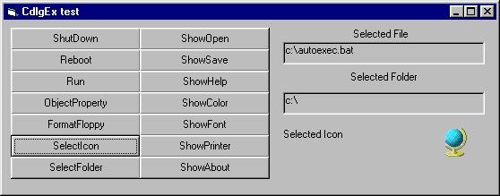



## Various windows dialogs in one class

### Description

Class with various windows dialogs - including standar common dialogs (open/save, print, font, color and help) as well as other (select folder(with pre-selecting ability), select icon, shutdown/restart, run file, Object Properties (ie. System, Printer, Disk, File etc.) and AboutBox. Add this class to your app and forget about comdlg32.ocx.
 
### More Info
 

             |
---                |---
**Submitted On**   |2000-11-11 14:25:04
**By**             |[Ark](https://github.com/Planet-Source-Code/PSCIndex/blob/master/ByAuthor/ark.md)
**Level**          |Intermediate
**User Rating**    |4.6 (37 globes from 8 users)
**Compatibility**  |VB 3\.0, VB 4\.0 \(16\-bit\), VB 4\.0 \(32\-bit\), VB 5\.0, VB 6\.0, VB Script, ASP \(Active Server Pages\) 
**Category**       |[Custom Controls/ Forms/  Menus](https://github.com/Planet-Source-Code/PSCIndex/blob/master/ByCategory/custom-controls-forms-menus__1-4.md)
**World**          |[Visual Basic](https://github.com/Planet-Source-Code/PSCIndex/blob/master/ByWorld/visual-basic.md)
**Archive File**   |[CODE\_UPLOAD1157111102000\.zip](https://github.com/Planet-Source-Code/ark-various-windows-dialogs-in-one-class__1-9260/archive/master.zip)

